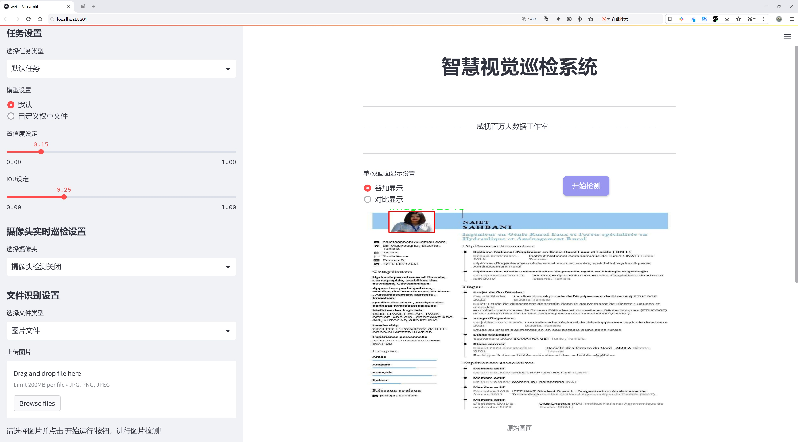
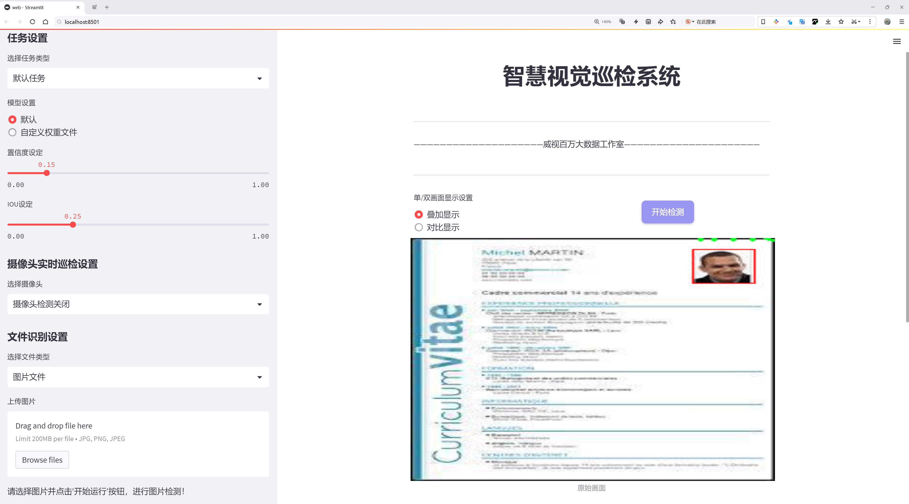
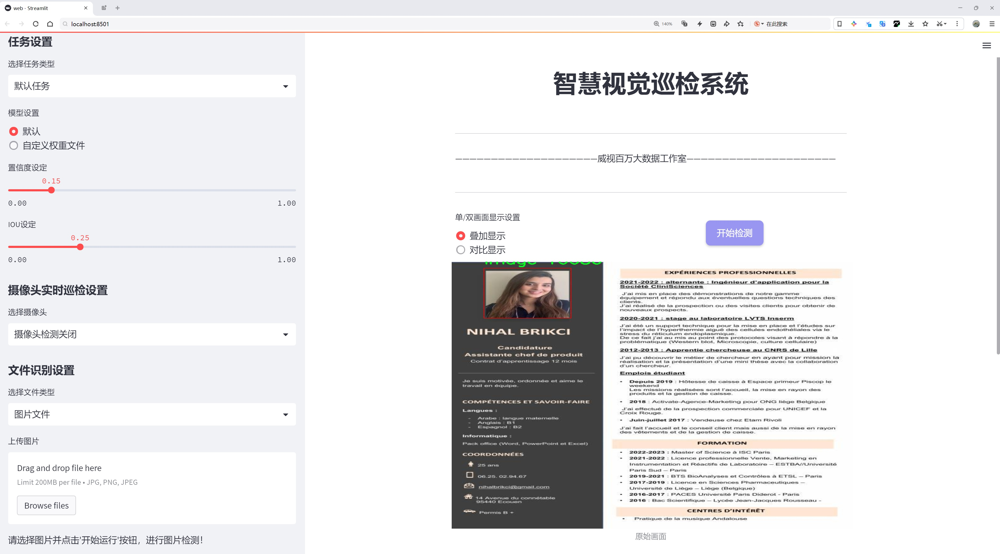
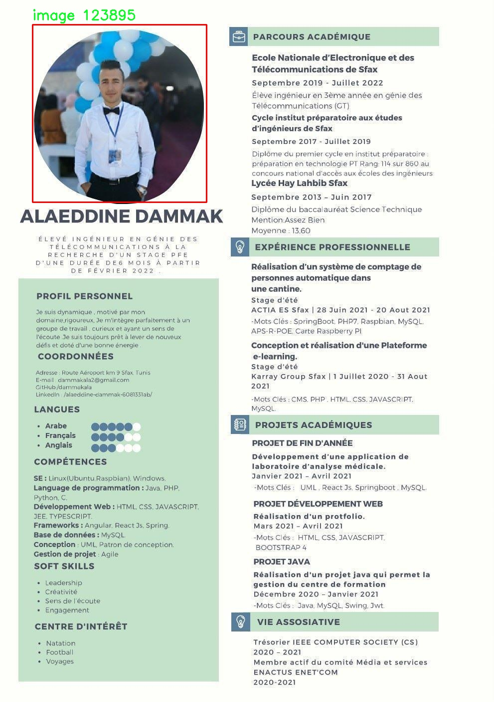
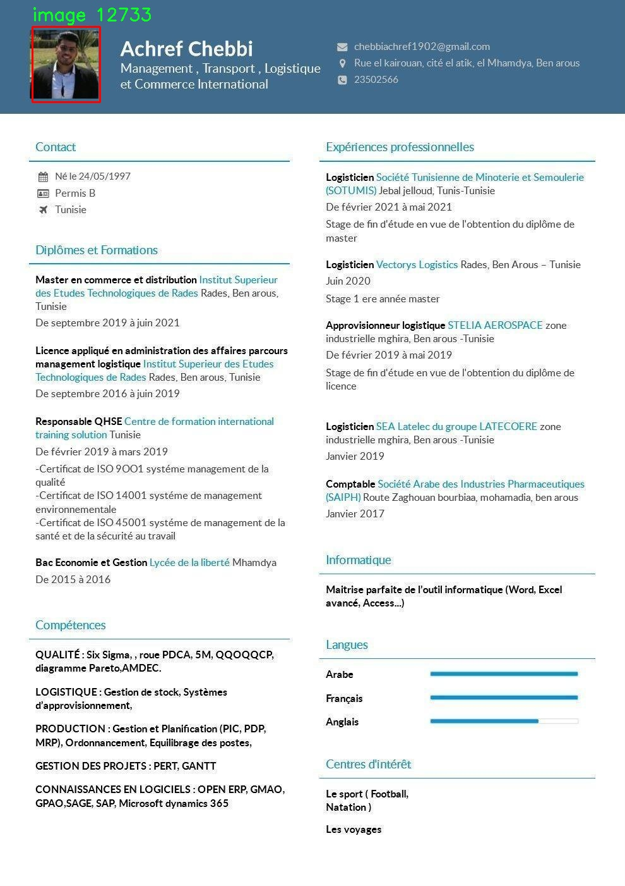
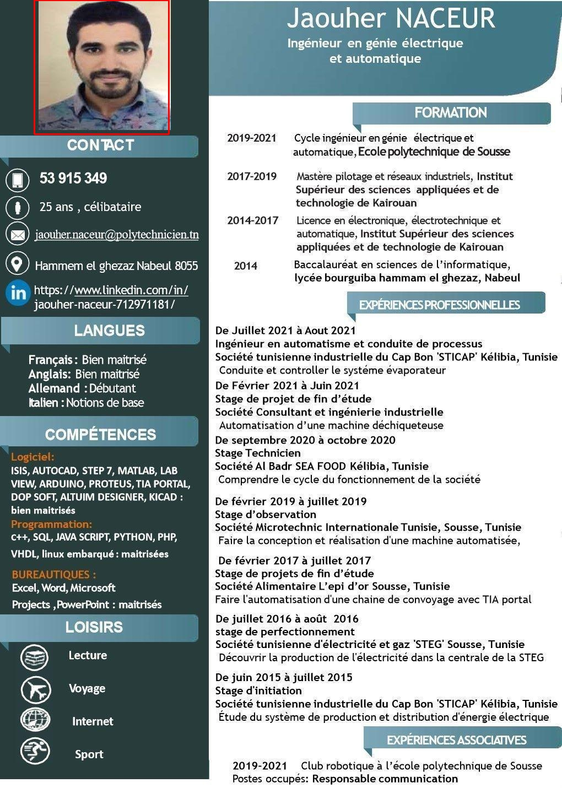

# 简历信息提取检测系统源码分享
 # [一条龙教学YOLOV8标注好的数据集一键训练_70+全套改进创新点发刊_Web前端展示]

### 1.研究背景与意义

项目参考[AAAI Association for the Advancement of Artificial Intelligence](https://gitee.com/qunmasj/projects)

项目来源[AACV Association for the Advancement of Computer Vision](https://kdocs.cn/l/cszuIiCKVNis)

研究背景与意义

随着信息技术的迅猛发展，数字化时代的到来使得各类信息的获取与处理变得愈加重要。在这一背景下，简历作为求职者与招聘者之间的桥梁，其信息提取的效率与准确性直接影响到招聘决策的质量。传统的简历筛选方式往往依赖人工审核，不仅耗时耗力，而且容易受到主观因素的影响，导致优秀人才的流失。因此，开发高效、准确的简历信息提取系统显得尤为重要。

近年来，深度学习技术的飞速发展为图像处理和信息提取提供了新的解决方案。YOLO（You Only Look Once）系列模型作为一种高效的目标检测算法，因其实时性和高准确率而广泛应用于各类视觉任务中。YOLOv8作为该系列的最新版本，进一步提升了模型的性能，尤其在处理复杂场景和多类别目标检测方面表现出色。基于YOLOv8的简历信息提取系统，能够在短时间内从大量简历中提取出关键信息，极大地提高了招聘流程的效率。

本研究将基于改进的YOLOv8模型，构建一个专门针对简历信息提取的系统。该系统将利用2400张简历图像，涵盖14个类别的信息，包括个人基本信息（如姓名、联系方式）、教育背景、工作经历、技能、证书等。通过对这些类别的深入分析与特征提取，系统将能够自动识别并分类简历中的各类信息，减少人工干预，提高信息提取的准确性和效率。

此外，随着求职市场的竞争日益激烈，求职者的简历格式和内容也日趋多样化，给信息提取带来了挑战。针对这一问题，本研究将通过对YOLOv8模型的改进，增强其对不同简历格式的适应能力，提高系统的鲁棒性和泛化能力。通过引入数据增强技术、迁移学习等方法，系统将能够更好地应对各种复杂情况，确保信息提取的全面性和准确性。

本研究的意义不仅在于提升简历信息提取的效率，更在于推动招聘行业的智能化发展。通过构建基于YOLOv8的简历信息提取系统，能够为企业提供更为科学的招聘决策依据，帮助企业快速筛选出符合岗位要求的人才。同时，求职者也能通过该系统更好地展示自身优势，提高求职成功率。综上所述，本研究在理论与实践层面均具有重要的学术价值和应用前景，为未来的招聘流程优化和人力资源管理提供了新的思路与方法。

### 2.图片演示







##### 注意：由于此博客编辑较早，上面“2.图片演示”和“3.视频演示”展示的系统图片或者视频可能为老版本，新版本在老版本的基础上升级如下：（实际效果以升级的新版本为准）

  （1）适配了YOLOV8的“目标检测”模型和“实例分割”模型，通过加载相应的权重（.pt）文件即可自适应加载模型。

  （2）支持“图片识别”、“视频识别”、“摄像头实时识别”三种识别模式。

  （3）支持“图片识别”、“视频识别”、“摄像头实时识别”三种识别结果保存导出，解决手动导出（容易卡顿出现爆内存）存在的问题，识别完自动保存结果并导出到tempDir中。

  （4）支持Web前端系统中的标题、背景图等自定义修改，后面提供修改教程。

  另外本项目提供训练的数据集和训练教程,暂不提供权重文件（best.pt）,需要您按照教程进行训练后实现图片演示和Web前端界面演示的效果。

### 3.视频演示

[3.1 视频演示](https://www.bilibili.com/video/BV1YosheaEFA/)

### 4.数据集信息展示

##### 4.1 本项目数据集详细数据（类别数＆类别名）

nc: 1
names: ['image']


##### 4.2 本项目数据集信息介绍

数据集信息展示

在本研究中，我们使用了名为“resume parsing”的数据集，旨在改进YOLOv8模型在简历信息提取系统中的应用效果。该数据集专注于简历图像的处理与分析，旨在通过深度学习技术实现对简历内容的自动识别与提取。数据集的设计充分考虑了简历的多样性和复杂性，确保能够涵盖不同格式、布局和风格的简历，从而为模型的训练提供丰富的样本。

该数据集的类别数量为1，类别列表中仅包含“image”这一项。这一设计反映了数据集的专一性，主要聚焦于图像数据的处理。通过对简历图像的标注和分类，研究者能够训练出一个高效的模型，以识别简历中的关键信息，如姓名、联系方式、教育背景、工作经历和技能等。这种信息提取能力对于招聘系统、人才管理和人力资源分析等领域具有重要的应用价值。

在数据集的构建过程中，研究团队收集了来自不同来源的简历样本，确保数据的多样性和代表性。这些样本包括各种格式的简历，如PDF、Word文档以及图像格式（如JPEG和PNG），并经过预处理以统一图像的尺寸和质量。每个简历图像都经过精细的标注，确保模型在训练过程中能够学习到简历中各个信息块的特征和位置。

为了提高模型的泛化能力，数据集还采用了数据增强技术，包括旋转、缩放、裁剪和颜色调整等。这些技术不仅增加了训练样本的数量，还提高了模型对不同简历格式和排版风格的适应能力。通过这种方式，模型能够在面对真实世界中的多样化简历时，依然保持高效的识别能力。

在训练过程中，YOLOv8模型通过对“resume parsing”数据集的学习，逐步优化其参数，以提高对简历信息的提取精度。模型的训练过程采用了先进的深度学习框架，结合了卷积神经网络（CNN）和目标检测算法，确保能够高效地处理图像数据并提取出关键信息。通过反复迭代和调优，模型的性能得到了显著提升，能够在复杂背景和不同排版的简历中，准确识别出所需的信息。

最终，经过充分的训练和验证，该简历信息提取系统不仅能够提高招聘效率，还能减少人工筛选简历的时间成本。研究结果表明，基于“resume parsing”数据集训练的YOLOv8模型，在简历信息提取任务中表现出色，具有良好的实用性和推广价值。通过这一研究，我们期待能够为人力资源管理领域带来更智能化的解决方案，推动招聘流程的自动化和高效化。








### 5.全套项目环境部署视频教程（零基础手把手教学）

[5.1 环境部署教程链接（零基础手把手教学）](https://www.ixigua.com/7404473917358506534?logTag=c807d0cbc21c0ef59de5)


[5.2 安装Python虚拟环境创建和依赖库安装视频教程链接（零基础手把手教学）](https://www.ixigua.com/7404474678003106304?logTag=1f1041108cd1f708b01a)

### 6.手把手YOLOV8训练视频教程（零基础小白有手就能学会）

[6.1 手把手YOLOV8训练视频教程（零基础小白有手就能学会）](https://www.ixigua.com/7404477157818401292?logTag=d31a2dfd1983c9668658)

### 7.70+种全套YOLOV8创新点代码加载调参视频教程（一键加载写好的改进模型的配置文件）

[7.1 70+种全套YOLOV8创新点代码加载调参视频教程（一键加载写好的改进模型的配置文件）](https://www.ixigua.com/7404478314661806627?logTag=29066f8288e3f4eea3a4)

### 8.70+种全套YOLOV8创新点原理讲解（非科班也可以轻松写刊发刊，V10版本正在科研待更新）

由于篇幅限制，每个创新点的具体原理讲解就不一一展开，具体见下列网址中的创新点对应子项目的技术原理博客网址【Blog】：


[8.1 70+种全套YOLOV8创新点原理讲解链接](https://gitee.com/qunmasj/good)

### 9.系统功能展示（检测对象为举例，实际内容以本项目数据集为准）

图9.1.系统支持检测结果表格显示

  图9.2.系统支持置信度和IOU阈值手动调节

  图9.3.系统支持自定义加载权重文件best.pt(需要你通过步骤5中训练获得)

  图9.4.系统支持摄像头实时识别

  图9.5.系统支持图片识别

  图9.6.系统支持视频识别

  图9.7.系统支持识别结果文件自动保存

  图9.8.系统支持Excel导出检测结果数据


### 10.原始YOLOV8算法原理

原始YOLOv8算法原理

YOLO（You Only Look Once）系列算法自其首次提出以来，便以其独特的框架和高效的目标检测能力而闻名。YOLOv8作为该系列的最新版本，继承并发展了前几代算法的优点，同时在多个方面进行了创新和优化。其核心思想依然是将目标检测任务转化为一个回归问题，通过一个单一的神经网络模型来同时预测目标的位置和类别。然而，YOLOv8在此基础上进行了多项改进，使其在训练时间和检测精度上都有显著提升。

YOLOv8的网络结构由主干网络（backbone）、特征增强网络（neck）和检测头（head）三部分组成。主干网络采用了CSP（Cross Stage Partial）结构，旨在提高特征提取的效率和准确性。CSP结构的设计理念是将特征提取过程分为两部分，分别进行卷积和连接，这样不仅能够增强特征的多样性，还能有效减少计算量。YOLOv8在主干网络中使用了C2f模块，这一模块的设计灵感来源于YOLOv5的C3模块以及YOLOv7的ELAN思想，进一步提升了模型的轻量化和检测精度。

在特征增强网络方面，YOLOv8引入了PAN-FPN（Path Aggregation Network - Feature Pyramid Network）结构，这一结构的优势在于能够有效地融合来自不同层次的特征信息，增强模型对多尺度目标的检测能力。通过自下而上的高层特征与中层、浅层特征的融合，YOLOv8能够在不同分辨率下获取丰富的语义信息，从而提高目标检测的准确性。

YOLOv8的检测头部分则采用了解耦头结构，这一创新的设计将目标分类和边框回归任务分为两个独立的分支，使得每个任务能够更加专注于自身的目标。这种解耦设计不仅提高了模型在复杂场景下的定位精度，还有效减少了分类错误的发生。此外，YOLOv8摒弃了传统的Anchor-based方法，转而采用Anchor-free的目标检测策略。这种方法通过直接预测目标的位置和大小，避免了锚点框选择和调整的繁琐过程，使得模型在处理不同尺度和形状的目标时更加灵活高效。

在损失函数的设计上，YOLOv8采用了VFLLoss作为分类损失，并结合DFLLoss和CIoULoss来优化回归任务。这一组合损失函数的使用，使得模型在训练过程中能够更好地应对样本不平衡的问题，尤其是在面对小目标和难以分类的样本时，能够有效提升检测精度。

值得一提的是，YOLOv8在样本匹配策略上也进行了改进，将静态匹配改为Task-Aligned的Assigner匹配方式。这一变化使得模型在训练时能够更好地适应不同的任务需求，从而提高了整体的检测性能。

YOLOv8的训练过程同样采用了先进的数据增强技术，包括马赛克增强、混合增强、空间扰动和颜色扰动等。这些增强手段的引入，能够有效提高模型的泛化能力，使其在面对不同场景和条件下的目标检测任务时，依然能够保持高效的性能。

总的来说，YOLOv8通过一系列创新和优化，不仅继承了YOLO系列算法的优良传统，还在目标检测的准确性、速度和效率上达到了新的高度。其轻量化的模型设计使得YOLOv8能够在各种嵌入式设备上进行实时检测，满足了现代计算机视觉应用日益增长的需求。随着YOLOv8的推出，目标检测领域无疑将迎来新的发展机遇，为各类应用场景提供更加精准和高效的解决方案。


### 11.项目核心源码讲解（再也不用担心看不懂代码逻辑）

#### 11.1 70+种YOLOv8算法改进源码大全和调试加载训练教程（非必要）\ultralytics\models\yolo\detect\predict.py

以下是经过简化和注释的核心代码部分：

```python
# 导入必要的模块
from ultralytics.engine.predictor import BasePredictor
from ultralytics.engine.results import Results
from ultralytics.utils import ops

class DetectionPredictor(BasePredictor):
    """
    DetectionPredictor类，继承自BasePredictor，用于基于检测模型进行预测。
    """

    def postprocess(self, preds, img, orig_imgs):
        """
        对预测结果进行后处理，并返回Results对象的列表。

        参数:
        preds: 模型的预测结果
        img: 输入图像
        orig_imgs: 原始图像（可能是一个Tensor或列表）

        返回:
        results: 包含后处理结果的Results对象列表
        """
        # 应用非极大值抑制（NMS）来过滤预测框
        preds = ops.non_max_suppression(preds,
                                         self.args.conf,        # 置信度阈值
                                         self.args.iou,         # IOU阈值
                                         agnostic=self.args.agnostic_nms,  # 是否类别无关的NMS
                                         max_det=self.args.max_det,  # 最大检测框数量
                                         classes=self.args.classes)  # 需要检测的类别

        # 如果输入的原始图像不是列表，则将其转换为numpy数组
        if not isinstance(orig_imgs, list):
            orig_imgs = ops.convert_torch2numpy_batch(orig_imgs)

        results = []  # 初始化结果列表
        for i, pred in enumerate(preds):  # 遍历每个预测结果
            orig_img = orig_imgs[i]  # 获取对应的原始图像
            # 将预测框的坐标从缩放后的图像尺寸转换为原始图像尺寸
            pred[:, :4] = ops.scale_boxes(img.shape[2:], pred[:, :4], orig_img.shape)
            img_path = self.batch[0][i]  # 获取图像路径
            # 创建Results对象并添加到结果列表
            results.append(Results(orig_img, path=img_path, names=self.model.names, boxes=pred))
        
        return results  # 返回后处理结果
```

### 代码分析与注释说明：
1. **导入模块**：引入了必要的类和函数，以便进行模型预测和结果处理。
2. **DetectionPredictor类**：这是一个用于检测模型预测的类，继承自`BasePredictor`。
3. **postprocess方法**：这是一个关键方法，用于对模型的预测结果进行后处理。
   - **非极大值抑制**：通过`ops.non_max_suppression`函数过滤掉重叠的预测框，保留最有可能的框。
   - **图像转换**：确保原始图像是以numpy数组的形式存在，以便后续处理。
   - **坐标缩放**：将预测框的坐标从缩放后的图像尺寸转换为原始图像的尺寸，以确保框的位置准确。
   - **结果收集**：将每个预测结果和对应的原始图像、路径等信息封装成`Results`对象，并添加到结果列表中。

该代码的核心功能是处理YOLO模型的预测结果，并将其转换为可用的格式，以便后续的分析或可视化。

这个文件是Ultralytics YOLO模型的一个预测模块，主要用于基于检测模型进行目标检测的预测。文件中定义了一个名为`DetectionPredictor`的类，它继承自`BasePredictor`类，提供了目标检测的功能。

在这个类的文档字符串中，给出了一个使用示例，展示了如何使用`DetectionPredictor`进行预测。示例中，首先从Ultralytics库中导入必要的模块，然后创建一个包含模型路径和数据源的参数字典。接着，实例化`DetectionPredictor`对象，并调用`predict_cli()`方法进行预测。

类中定义了一个`postprocess`方法，该方法用于对模型的预测结果进行后处理。具体来说，它接收三个参数：`preds`（模型的预测结果）、`img`（输入图像）和`orig_imgs`（原始图像）。在方法内部，首先使用非极大值抑制（NMS）来过滤预测结果，去除冗余的框，保留最有可能的检测结果。NMS的参数包括置信度阈值、IOU阈值、是否进行类别无关的NMS、最大检测数量以及指定的类别。

接下来，方法检查输入的原始图像是否为列表。如果不是，则将其转换为NumPy数组。然后，遍历每个预测结果，使用`scale_boxes`函数将预测框的坐标缩放到原始图像的尺寸。最后，将处理后的结果封装为`Results`对象，并返回一个包含所有结果的列表。

总的来说，这个文件实现了YOLO模型的预测功能，提供了对预测结果的后处理，以便于用户获取最终的检测结果。

#### 11.2 ui.py

```python
import sys
import subprocess

def run_script(script_path):
    """
    使用当前 Python 环境运行指定的脚本。

    Args:
        script_path (str): 要运行的脚本路径

    Returns:
        None
    """
    # 获取当前 Python 解释器的路径
    python_path = sys.executable

    # 构建运行命令
    command = f'"{python_path}" -m streamlit run "{script_path}"'

    # 执行命令
    result = subprocess.run(command, shell=True)
    if result.returncode != 0:
        print("脚本运行出错。")


# 实例化并运行应用
if __name__ == "__main__":
    # 指定您的脚本路径
    script_path = "web.py"  # 这里可以直接指定脚本名称

    # 运行脚本
    run_script(script_path)
```

### 代码注释

1. **导入模块**：
   - `import sys`：导入系统相关的模块，用于获取当前 Python 解释器的路径。
   - `import subprocess`：导入子进程模块，用于在 Python 中执行外部命令。

2. **定义函数 `run_script`**：
   - 该函数接收一个参数 `script_path`，表示要运行的 Python 脚本的路径。
   - 使用 `sys.executable` 获取当前 Python 解释器的路径，以便在当前环境中运行脚本。
   - 构建一个命令字符串 `command`，使用 `streamlit` 模块运行指定的脚本。
   - 使用 `subprocess.run` 执行构建的命令。如果命令执行失败（返回码不为 0），则打印错误信息。

3. **主程序入口**：
   - 使用 `if __name__ == "__main__":` 确保该代码块仅在直接运行脚本时执行。
   - 指定要运行的脚本路径，这里简化为直接使用脚本名称 `"web.py"`。
   - 调用 `run_script` 函数来执行指定的脚本。

这个程序文件名为 `ui.py`，主要功能是通过当前的 Python 环境运行一个指定的脚本，具体是一个名为 `web.py` 的 Streamlit 应用。

首先，程序导入了几个必要的模块，包括 `sys`、`os` 和 `subprocess`。其中，`sys` 模块用于访问与 Python 解释器相关的变量和函数，`os` 模块提供了与操作系统交互的功能，而 `subprocess` 模块则用于生成新的进程、连接到它们的输入/输出/错误管道，并获取它们的返回码。

接下来，程序从 `QtFusion.path` 模块中导入了 `abs_path` 函数，这个函数的作用是获取文件的绝对路径。

程序中定义了一个名为 `run_script` 的函数，该函数接受一个参数 `script_path`，表示要运行的脚本的路径。在函数内部，首先获取当前 Python 解释器的路径，并将其存储在 `python_path` 变量中。然后，构建一个命令字符串 `command`，该命令用于调用 Streamlit 运行指定的脚本。命令的格式是 `"{python_path}" -m streamlit run "{script_path}"`，这意味着使用当前的 Python 解释器执行 Streamlit 模块，并运行指定的脚本。

接着，使用 `subprocess.run` 方法执行构建好的命令。`shell=True` 参数表示在 shell 中执行命令。执行完命令后，程序检查返回码 `result.returncode`，如果返回码不为 0，表示脚本运行出错，程序会打印出“脚本运行出错。”的提示信息。

最后，在程序的主入口部分，使用 `if __name__ == "__main__":` 判断程序是否是直接运行。如果是，则调用 `abs_path` 函数获取 `web.py` 的绝对路径，并将其存储在 `script_path` 变量中。随后，调用 `run_script` 函数来运行这个脚本。

总体来说，这个程序的主要目的是提供一个简单的接口，通过当前的 Python 环境来运行一个 Streamlit 应用脚本，并处理可能出现的错误。

#### 11.3 code\ultralytics\data\annotator.py

以下是经过简化和注释的核心代码部分：

```python
from pathlib import Path
from ultralytics import SAM, YOLO

def auto_annotate(data, det_model="yolov8x.pt", sam_model="sam_b.pt", device="", output_dir=None):
    """
    自动为图像添加注释，使用YOLO目标检测模型和SAM分割模型。

    参数:
        data (str): 包含待注释图像的文件夹路径。
        det_model (str, optional): 预训练的YOLO检测模型，默认为'yolov8x.pt'。
        sam_model (str, optional): 预训练的SAM分割模型，默认为'sam_b.pt'。
        device (str, optional): 模型运行的设备，默认为空字符串（CPU或可用的GPU）。
        output_dir (str | None | optional): 保存注释结果的目录，默认为与'data'相同目录下的'labels'文件夹。

    示例:
        auto_annotate(data='ultralytics/assets', det_model='yolov8n.pt', sam_model='mobile_sam.pt')
    """
    # 加载YOLO检测模型和SAM分割模型
    det_model = YOLO(det_model)
    sam_model = SAM(sam_model)

    # 将数据路径转换为Path对象
    data = Path(data)
    
    # 如果未指定输出目录，则创建一个默认的输出目录
    if not output_dir:
        output_dir = data.parent / f"{data.stem}_auto_annotate_labels"
    Path(output_dir).mkdir(exist_ok=True, parents=True)  # 创建输出目录

    # 使用YOLO模型进行目标检测
    det_results = det_model(data, stream=True, device=device)

    # 遍历检测结果
    for result in det_results:
        class_ids = result.boxes.cls.int().tolist()  # 获取检测到的类别ID
        if len(class_ids):  # 如果检测到目标
            boxes = result.boxes.xyxy  # 获取边界框坐标
            # 使用SAM模型进行分割，传入边界框
            sam_results = sam_model(result.orig_img, bboxes=boxes, verbose=False, save=False, device=device)
            segments = sam_results[0].masks.xyn  # 获取分割结果

            # 将分割结果写入文本文件
            with open(f"{Path(output_dir) / Path(result.path).stem}.txt", "w") as f:
                for i in range(len(segments)):
                    s = segments[i]
                    if len(s) == 0:  # 如果没有分割结果，跳过
                        continue
                    segment = map(str, segments[i].reshape(-1).tolist())  # 将分割结果转换为字符串
                    f.write(f"{class_ids[i]} " + " ".join(segment) + "\n")  # 写入类别ID和分割坐标
```

### 代码说明：
1. **导入必要的库**：使用`pathlib`处理文件路径，使用`ultralytics`库中的`SAM`和`YOLO`模型进行目标检测和分割。
2. **定义`auto_annotate`函数**：该函数负责自动为图像添加注释。
3. **加载模型**：初始化YOLO和SAM模型。
4. **处理输入路径**：将输入的图像路径转换为`Path`对象，并设置输出目录。
5. **检测目标**：使用YOLO模型对图像进行目标检测，获取检测结果。
6. **处理检测结果**：遍历每个检测结果，提取类别ID和边界框信息，并使用SAM模型进行分割。
7. **保存结果**：将每个检测到的目标的类别ID和分割坐标保存到文本文件中。

这个程序文件是用于自动标注图像的，主要依赖于YOLO（You Only Look Once）目标检测模型和SAM（Segment Anything Model）分割模型。其核心功能是从指定的图像文件夹中读取图像，使用YOLO模型进行目标检测，然后利用SAM模型对检测到的目标进行分割，最终将标注结果保存到指定的输出目录。

程序的主要函数是`auto_annotate`，它接受多个参数，包括数据路径、检测模型、分割模型、设备类型和输出目录。`data`参数是一个字符串，指向包含待标注图像的文件夹。`det_model`和`sam_model`参数分别指定了预训练的YOLO检测模型和SAM分割模型，默认值分别为'yolov8x.pt'和'sam_b.pt'。`device`参数用于指定运行模型的设备，可以是CPU或GPU，默认为空字符串，表示自动选择可用设备。`output_dir`参数用于指定保存标注结果的目录，如果未提供，则默认在数据路径的同级目录下创建一个名为“_auto_annotate_labels”的文件夹。

在函数内部，首先加载YOLO和SAM模型。接着，使用`Path`模块处理数据路径，并根据需要创建输出目录。然后，调用YOLO模型对数据进行目标检测，结果以流的形式返回。对于每个检测结果，提取出类别ID和边界框信息，并将这些边界框传递给SAM模型进行分割。分割结果以掩码的形式返回。

最后，程序将每个图像的分割结果写入到一个文本文件中，文件名与原图像相同，后缀为.txt。每一行包含类别ID和对应的分割坐标，坐标通过reshape和tolist方法转换为字符串格式，方便后续处理。

这个程序的设计旨在简化图像标注的过程，适合需要大量图像标注的计算机视觉任务。通过结合目标检测和图像分割技术，用户可以快速获得高质量的标注结果。

#### 11.4 70+种YOLOv8算法改进源码大全和调试加载训练教程（非必要）\ultralytics\data\augment.py

以下是代码中最核心的部分，并附上详细的中文注释：

```python
class BaseTransform:
    """
    图像变换的基类。

    这是一个通用的变换类，可以根据特定的图像处理需求进行扩展。
    该类旨在与分类和语义分割任务兼容。

    方法：
        __init__: 初始化 BaseTransform 对象。
        apply_image: 对标签应用图像变换。
        apply_instances: 对标签中的对象实例应用变换。
        apply_semantic: 对图像应用语义分割变换。
        __call__: 对图像、实例和语义掩码应用所有标签变换。
    """

    def __init__(self) -> None:
        """初始化 BaseTransform 对象。"""
        pass

    def apply_image(self, labels):
        """对标签应用图像变换。"""
        pass

    def apply_instances(self, labels):
        """对标签中的对象实例应用变换。"""
        pass

    def apply_semantic(self, labels):
        """对图像应用语义分割变换。"""
        pass

    def __call__(self, labels):
        """对图像、实例和语义掩码应用所有标签变换。"""
        self.apply_image(labels)
        self.apply_instances(labels)
        self.apply_semantic(labels)


class Mosaic(BaseMixTransform):
    """
    马赛克增强。

    该类通过将多个（4或9）张图像组合成一张马赛克图像来执行马赛克增强。
    增强应用于具有给定概率的数据集。

    属性：
        dataset: 应用马赛克增强的数据集。
        imgsz (int, optional): 单张图像经过马赛克处理后的图像大小（高度和宽度）。默认为640。
        p (float, optional): 应用马赛克增强的概率。必须在0-1范围内。默认为1.0。
        n (int, optional): 网格大小，可以是4（2x2）或9（3x3）。
    """

    def __init__(self, dataset, imgsz=640, p=1.0, n=4):
        """初始化对象，包含数据集、图像大小、概率和边界。"""
        assert 0 <= p <= 1.0, f'概率应在[0, 1]范围内，但得到的是 {p}。'
        assert n in (4, 9), '网格必须等于4或9。'
        super().__init__(dataset=dataset, p=p)
        self.dataset = dataset
        self.imgsz = imgsz
        self.border = (-imgsz // 2, -imgsz // 2)  # 边界宽度和高度
        self.n = n

    def get_indexes(self, buffer=True):
        """返回数据集中随机索引的列表。"""
        if buffer:  # 从缓冲区选择图像
            return random.choices(list(self.dataset.buffer), k=self.n - 1)
        else:  # 选择任意图像
            return [random.randint(0, len(self.dataset) - 1) for _ in range(self.n - 1)]

    def _mix_transform(self, labels):
        """对标签字典应用 MixUp 或 Mosaic 增强。"""
        assert labels.get('rect_shape', None) is None, 'rect 和 mosaic 是互斥的。'
        assert len(labels.get('mix_labels', [])), '没有其他图像用于马赛克增强。'
        return self._mosaic4(labels) if self.n == 4 else self._mosaic9(labels)

    def _mosaic4(self, labels):
        """创建 2x2 图像马赛克。"""
        mosaic_labels = []
        s = self.imgsz
        yc, xc = (int(random.uniform(-x, 2 * s + x)) for x in self.border)  # 马赛克中心 x, y
        for i in range(4):
            labels_patch = labels if i == 0 else labels['mix_labels'][i - 1]
            img = labels_patch['img']
            h, w = labels_patch.pop('resized_shape')

            # 将图像放置在 img4 中
            if i == 0:  # 左上角
                img4 = np.full((s * 2, s * 2, img.shape[2]), 114, dtype=np.uint8)  # 以 114 填充的基础图像
                x1a, y1a, x2a, y2a = max(xc - w, 0), max(yc - h, 0), xc, yc  # 大图像的 xmin, ymin, xmax, ymax
                x1b, y1b, x2b, y2b = w - (x2a - x1a), h - (y2a - y1a), w, h  # 小图像的 xmin, ymin, xmax, ymax
            # 其他位置的处理类似...

            img4[y1a:y2a, x1a:x2a] = img[y1b:y2b, x1b:x2b]  # 将图像放入 img4
            padw = x1a - x1b
            padh = y1a - y1b

            labels_patch = self._update_labels(labels_patch, padw, padh)
            mosaic_labels.append(labels_patch)
        final_labels = self._cat_labels(mosaic_labels)
        final_labels['img'] = img4
        return final_labels

    # 其他方法和类的实现...
```

在上述代码中，`BaseTransform` 类是图像变换的基类，提供了应用不同变换的方法。`Mosaic` 类实现了马赛克增强，通过将多张图像组合成一张图像来增强数据集。具体的实现细节和其他辅助方法在类中进行了定义。

这个程序文件是YOLOv8算法中用于数据增强的模块，主要负责对输入图像及其对应的标签进行各种变换，以提高模型的鲁棒性和泛化能力。文件中定义了多个类，每个类实现了一种或多种数据增强技术。

首先，`BaseTransform`类是一个基类，定义了图像变换的基本接口，包括应用于图像、实例和语义分割的变换方法。它的`__call__`方法可以一次性应用所有变换。

`Compose`类用于将多个变换组合在一起，允许用户按顺序应用一系列变换。它提供了添加新变换和将变换列表转换为标准Python列表的方法。

`BaseMixTransform`类是一个基类，专门用于实现混合增强（如MixUp和Mosaic）。它的子类`Mosaic`实现了马赛克增强，通过将多个图像合并为一个图像来增加数据的多样性。该类支持2x2或3x3的网格组合，并且可以根据设定的概率进行增强。

`MixUp`类实现了MixUp增强，通过将两张图像及其标签进行加权组合，生成新的图像和标签。

`RandomPerspective`类实现了随机透视变换和仿射变换，可以对图像进行旋转、平移、缩放和剪切等操作，同时更新相应的边界框、分割和关键点。

`RandomHSV`类负责对图像的色调、饱和度和亮度进行随机调整，以增加图像的色彩多样性。

`RandomFlip`类实现了随机翻转图像的功能，可以进行水平或垂直翻转，并相应地更新实例的边界框和关键点。

`LetterBox`类用于调整图像大小并添加边框，以适应YOLO模型的输入要求。它确保图像在保持比例的情况下被调整到指定的形状。

`CopyPaste`类实现了Copy-Paste增强，允许将一个图像中的实例复制到另一个图像中，以增加数据的多样性。

`Albumentations`类提供了一系列额外的图像增强功能，如模糊、对比度限制自适应直方图均衡化等，依赖于外部库Albumentations。

最后，`Format`类用于格式化图像注释，以便在PyTorch的DataLoader中使用，确保边界框、分割和关键点的格式一致。

整个模块通过`v8_transforms`函数将不同的增强方法组合在一起，为YOLOv8模型的训练提供适合的输入数据。这个模块的设计旨在通过多样化训练数据来提高模型的性能和准确性。

#### 11.5 code\ui_style.py

以下是代码中最核心的部分，并附上详细的中文注释：

```python
import base64  # 导入base64模块，用于处理Base64编码
import streamlit as st  # 导入Streamlit库，用于构建Web应用

# 读取图片并转换为 Base64 编码的函数
def get_base64_of_bin_file(bin_file):
    with open(bin_file, 'rb') as file:  # 以二进制读取模式打开文件
        data = file.read()  # 读取文件内容
    return base64.b64encode(data).decode()  # 将读取的二进制数据编码为Base64并解码为字符串

# 定义CSS样式的函数
def def_css_hitml():
    st.markdown("""
        <style>
        /* 全局样式 */
        .css-2trqyj, .css-1d391kg, .st-bb, .st-at {
            font-family: 'Gill Sans', 'Gill Sans MT', Calibri, 'Trebuchet MS', sans-serif;  /* 设置字体 */
            background-color: #cadefc;  /* 设置背景颜色 */
            color: #21618C;  /* 设置字体颜色 */
        }

        /* 按钮样式 */
        .stButton > button {
            border: none;  /* 去掉按钮边框 */
            color: white;  /* 设置按钮文字颜色 */
            padding: 10px 20px;  /* 设置按钮内边距 */
            text-align: center;  /* 设置文字居中 */
            text-decoration: none;  /* 去掉文字下划线 */
            display: inline-block;  /* 设置为行内块元素 */
            font-size: 16px;  /* 设置字体大小 */
            margin: 2px 1px;  /* 设置按钮外边距 */
            cursor: pointer;  /* 鼠标悬停时显示为手型 */
            border-radius: 8px;  /* 设置按钮圆角 */
            background-color: #9896f1;  /* 设置按钮背景颜色 */
            box-shadow: 0 2px 4px 0 rgba(0,0,0,0.2);  /* 设置按钮阴影效果 */
            transition-duration: 0.4s;  /* 设置过渡效果时间 */
        }
        .stButton > button:hover {
            background-color: #5499C7;  /* 鼠标悬停时改变背景颜色 */
            color: white;  /* 鼠标悬停时保持文字颜色 */
            box-shadow: 0 8px 12px 0 rgba(0,0,0,0.24);  /* 鼠标悬停时改变阴影效果 */
        }

        /* 侧边栏样式 */
        .css-1lcbmhc.e1fqkh3o0 {
            background-color: #154360;  /* 设置侧边栏背景颜色 */
            color: #FDFEFE;  /* 设置侧边栏文字颜色 */
            border-right: 2px solid #DDD;  /* 设置右边框 */
        }

        /* Radio 按钮样式 */
        .stRadio > label {
            display: inline-flex;  /* 设置为行内弹性盒子 */
            align-items: center;  /* 垂直居中对齐 */
            cursor: pointer;  /* 鼠标悬停时显示为手型 */
        }
        .stRadio > label > span:first-child {
            background-color: #FFF;  /* 设置Radio按钮背景颜色 */
            border: 1px solid #CCC;  /* 设置边框 */
            width: 1em;  /* 设置宽度 */
            height: 1em;  /* 设置高度 */
            border-radius: 50%;  /* 设置为圆形 */
            margin-right: 10px;  /* 设置右边距 */
            display: inline-block;  /* 设置为行内块元素 */
        }

        /* 滑块样式 */
        .stSlider .thumb {
            background-color: #2E86C1;  /* 设置滑块的颜色 */
        }
        .stSlider .track {
            background-color: #DDD;  /* 设置滑块轨道的颜色 */
        }

        /* 表格样式 */
        table {
            border-collapse: collapse;  /* 合并边框 */
            margin: 25px 0;  /* 设置表格外边距 */
            font-size: 18px;  /* 设置字体大小 */
            font-family: sans-serif;  /* 设置字体 */
            min-width: 400px;  /* 设置表格最小宽度 */
            box-shadow: 0 5px 15px rgba(0, 0, 0, 0.2);  /* 设置表格阴影效果 */
        }
        thead tr {
            background-color: #a8d8ea;  /* 设置表头背景颜色 */
            color: #ffcef3;  /* 设置表头文字颜色 */
            text-align: left;  /* 设置表头文字左对齐 */
        }
        th, td {
            padding: 15px 18px;  /* 设置单元格内边距 */
        }
        tbody tr {
            border-bottom: 2px solid #ddd;  /* 设置行底部边框 */
        }
        tbody tr:nth-of-type(even) {
            background-color: #D6EAF8;  /* 设置偶数行背景颜色 */
        }
        tbody tr:last-of-type {
            border-bottom: 3px solid #5499C7;  /* 设置最后一行底部边框 */
        }
        tbody tr:hover {
            background-color: #AED6F1;  /* 鼠标悬停时改变行背景颜色 */
        }
        </style>
        """, unsafe_allow_html=True)  # 使用Markdown插入CSS样式，允许使用HTML
```

### 代码核心部分解释：
1. **Base64编码函数**：`get_base64_of_bin_file`函数用于读取指定的二进制文件（如图片），并将其内容转换为Base64编码字符串，方便在Web应用中使用。
2. **CSS样式定义**：`def_css_hitml`函数定义了应用的整体样式，包括全局样式、按钮样式、侧边栏样式、表格样式等，使用了Streamlit的`st.markdown`方法将CSS样式嵌入到应用中。通过设置不同的CSS属性，可以自定义应用的外观和交互效果。

这个程序文件 `ui_style.py` 是一个用于 Streamlit 应用的样式定义文件。它主要包含了对应用界面元素的样式设置，以提升用户体验和界面的美观性。

首先，文件导入了 `base64` 和 `streamlit` 库。`base64` 用于处理二进制文件的编码，而 `streamlit` 是一个用于构建数据应用的库。

接下来，定义了一个函数 `get_base64_of_bin_file(bin_file)`，该函数接受一个二进制文件的路径作为参数，读取文件内容并将其转换为 Base64 编码。这种编码方式常用于在网页中嵌入图像等二进制数据。

然后，定义了一个名为 `def_css_hitml()` 的函数，该函数使用 `st.markdown()` 方法将一段 CSS 样式代码嵌入到 Streamlit 应用中。CSS 样式代码包括了全局样式、按钮样式、侧边栏样式、单选按钮样式、滑块样式以及表格样式等多个部分。

在全局样式中，设置了字体、背景颜色和文字颜色，以统一应用的视觉风格。按钮样式部分定义了按钮的边框、颜色、内边距、字体大小、边距、圆角和背景色等属性，并为按钮的悬停状态设置了不同的背景色和阴影效果。

侧边栏样式则设置了背景色、文字颜色和边框，以使侧边栏在视觉上与主内容区区分开来。单选按钮和滑块的样式也进行了自定义，以提升交互体验。

最后，表格样式部分定义了表格的整体布局、字体、边距、背景色和边框等，确保表格在显示数据时既美观又易于阅读。

整体而言，这个文件通过定义一系列 CSS 样式，使得 Streamlit 应用的界面更加美观、易用，提升了用户的交互体验。

#### 11.6 train.py

以下是代码中最核心的部分，并附上详细的中文注释：

```python
class DetectionTrainer(BaseTrainer):
    """
    DetectionTrainer类用于基于检测模型进行训练，继承自BaseTrainer类。
    """

    def build_dataset(self, img_path, mode="train", batch=None):
        """
        构建YOLO数据集。

        参数:
            img_path (str): 包含图像的文件夹路径。
            mode (str): 模式，可以是'train'或'val'，用户可以为每种模式自定义不同的数据增强。
            batch (int, optional): 批次大小，仅用于'rect'模式。默认为None。
        """
        gs = max(int(de_parallel(self.model).stride.max() if self.model else 0), 32)
        return build_yolo_dataset(self.args, img_path, batch, self.data, mode=mode, rect=mode == "val", stride=gs)

    def get_dataloader(self, dataset_path, batch_size=16, rank=0, mode="train"):
        """构造并返回数据加载器。"""
        assert mode in ["train", "val"]  # 确保模式是'train'或'val'
        with torch_distributed_zero_first(rank):  # 在分布式环境中，确保数据集只初始化一次
            dataset = self.build_dataset(dataset_path, mode, batch_size)  # 构建数据集
        shuffle = mode == "train"  # 训练模式下打乱数据
        if getattr(dataset, "rect", False) and shuffle:
            LOGGER.warning("WARNING ⚠️ 'rect=True'与DataLoader的shuffle不兼容，设置shuffle=False")
            shuffle = False
        workers = self.args.workers if mode == "train" else self.args.workers * 2  # 设置工作线程数
        return build_dataloader(dataset, batch_size, workers, shuffle, rank)  # 返回数据加载器

    def preprocess_batch(self, batch):
        """对一批图像进行预处理，包括缩放和转换为浮点数。"""
        batch["img"] = batch["img"].to(self.device, non_blocking=True).float() / 255  # 将图像转换为浮点数并归一化
        if self.args.multi_scale:  # 如果启用多尺度
            imgs = batch["img"]
            sz = (
                random.randrange(self.args.imgsz * 0.5, self.args.imgsz * 1.5 + self.stride)
                // self.stride
                * self.stride
            )  # 随机选择新的尺寸
            sf = sz / max(imgs.shape[2:])  # 计算缩放因子
            if sf != 1:
                ns = [
                    math.ceil(x * sf / self.stride) * self.stride for x in imgs.shape[2:]
                ]  # 计算新的形状
                imgs = nn.functional.interpolate(imgs, size=ns, mode="bilinear", align_corners=False)  # 进行插值缩放
            batch["img"] = imgs  # 更新批次中的图像
        return batch

    def get_model(self, cfg=None, weights=None, verbose=True):
        """返回YOLO检测模型。"""
        model = DetectionModel(cfg, nc=self.data["nc"], verbose=verbose and RANK == -1)  # 创建检测模型
        if weights:
            model.load(weights)  # 加载权重
        return model

    def get_validator(self):
        """返回用于YOLO模型验证的DetectionValidator。"""
        self.loss_names = "box_loss", "cls_loss", "dfl_loss"  # 定义损失名称
        return yolo.detect.DetectionValidator(
            self.test_loader, save_dir=self.save_dir, args=copy(self.args), _callbacks=self.callbacks
        )  # 返回验证器

    def plot_training_samples(self, batch, ni):
        """绘制带有注释的训练样本。"""
        plot_images(
            images=batch["img"],
            batch_idx=batch["batch_idx"],
            cls=batch["cls"].squeeze(-1),
            bboxes=batch["bboxes"],
            paths=batch["im_file"],
            fname=self.save_dir / f"train_batch{ni}.jpg",
            on_plot=self.on_plot,
        )  # 绘制图像并保存

    def plot_metrics(self):
        """从CSV文件中绘制指标。"""
        plot_results(file=self.csv, on_plot=self.on_plot)  # 保存结果图像
```

### 代码核心部分说明：
1. **DetectionTrainer类**：这是一个用于训练YOLO检测模型的类，继承自BaseTrainer。
2. **build_dataset方法**：用于构建YOLO数据集，支持训练和验证模式。
3. **get_dataloader方法**：构造数据加载器，确保在分布式训练中只初始化一次数据集。
4. **preprocess_batch方法**：对图像批次进行预处理，包括归一化和多尺度调整。
5. **get_model方法**：返回YOLO检测模型，并可选择加载预训练权重。
6. **get_validator方法**：返回用于模型验证的验证器。
7. **plot_training_samples和plot_metrics方法**：用于可视化训练样本和训练指标。

这个程序文件 `train.py` 是一个用于训练目标检测模型的脚本，主要基于 YOLO（You Only Look Once）模型。它扩展了一个基础训练类 `BaseTrainer`，并提供了一系列方法来构建数据集、加载数据、预处理图像、设置模型属性、获取模型、验证模型、记录损失、绘制训练进度和结果等。

在文件开头，导入了一些必要的库和模块，包括数学运算、随机数生成、深度学习框架 PyTorch 的神经网络模块、数据处理模块、模型构建模块以及一些工具函数。

`DetectionTrainer` 类是该文件的核心，提供了多个方法来实现训练过程中的各个步骤。首先，`build_dataset` 方法用于构建 YOLO 数据集，接受图像路径、模式（训练或验证）和批次大小作为参数。该方法根据模型的步幅（stride）来确定图像的处理方式。

`get_dataloader` 方法用于构建数据加载器，确保在分布式训练中只初始化一次数据集，并根据训练或验证模式设置数据加载的参数，如是否打乱数据和工作线程的数量。

`preprocess_batch` 方法对图像批次进行预处理，包括将图像缩放到适当的大小并转换为浮点数格式，以便于模型处理。如果启用了多尺度训练，它会随机选择一个尺寸并对图像进行插值调整。

`set_model_attributes` 方法用于设置模型的属性，包括类别数量和类别名称，以便模型能够正确识别和处理不同的目标。

`get_model` 方法返回一个 YOLO 检测模型，并可选择加载预训练权重。`get_validator` 方法则返回一个用于验证模型性能的验证器。

`label_loss_items` 方法用于生成带有标签的损失字典，方便在训练过程中记录和分析损失情况。`progress_string` 方法返回一个格式化的字符串，显示训练进度，包括当前的轮次、GPU 内存使用情况、损失值、实例数量和图像大小等信息。

`plot_training_samples` 方法用于绘制训练样本及其标注，便于可视化训练数据的质量。最后，`plot_metrics` 和 `plot_training_labels` 方法分别用于绘制训练过程中的指标和生成带标签的训练图，以便分析模型的训练效果。

总体而言，这个文件提供了一个完整的框架，用于训练 YOLO 模型，涵盖了数据处理、模型构建、训练过程监控和结果可视化等多个方面。

### 12.系统整体结构（节选）

### 整体功能和构架概括

该项目是一个基于YOLOv8算法的目标检测系统，包含多个模块和文件，旨在提供完整的训练、预测和数据处理功能。项目的主要功能包括：

1. **数据增强**：通过不同的图像处理技术增强训练数据，以提高模型的泛化能力。
2. **模型训练**：实现YOLOv8模型的训练过程，包括数据加载、模型构建、损失计算和训练监控。
3. **目标检测**：使用训练好的模型进行目标检测，输出检测结果。
4. **用户界面**：提供一个用户友好的界面，允许用户通过Streamlit进行交互式操作。
5. **结果可视化**：支持训练过程中的损失和指标可视化，帮助用户理解模型性能。

### 文件功能整理表

| 文件路径                                                                 | 功能描述                                                                                          |
|--------------------------------------------------------------------------|---------------------------------------------------------------------------------------------------|
| `ultralytics/models/yolo/detect/predict.py`                             | 实现YOLO模型的预测功能，包含结果后处理和非极大值抑制等。                                          |
| `ui.py`                                                                  | 提供一个接口，通过Streamlit运行指定的脚本（如web.py），用于用户交互。                             |
| `code/ultralytics/data/annotator.py`                                    | 实现自动标注图像的功能，结合YOLO和SAM模型进行目标检测和分割。                                    |
| `ultralytics/data/augment.py`                                           | 定义多种数据增强技术，以提高训练数据的多样性和模型的鲁棒性。                                     |
| `code/ui_style.py`                                                      | 定义Streamlit应用的CSS样式，提升用户界面的美观性和可用性。                                      |
| `train.py`                                                              | 实现YOLO模型的训练过程，包括数据集构建、模型设置、训练监控和结果可视化等。                       |
| `code/ultralytics/utils/loss.py`                                        | 定义损失函数，计算模型训练过程中的损失值，以指导模型优化。                                       |
| `code/ultralytics/engine/trainer.py`                                    | 实现训练引擎，管理训练过程中的各个步骤，如数据加载、模型训练和验证等。                           |
| `ultralytics/nn/backbone/efficientViT.py`                               | 定义EfficientViT模型作为YOLO的骨干网络，提供高效的特征提取能力。                                 |
| `code/ultralytics/utils/tuner.py`                                       | 提供模型超参数调优的功能，帮助用户优化模型性能。                                                 |
| `ultralytics/models/yolo/segment/val.py`                                | 实现YOLO模型的验证功能，评估模型在验证集上的性能。                                              |
| `ultralytics/nn/extra_modules/afpn.py`                                  | 定义额外的特征金字塔网络（AFPN），用于增强特征提取和目标检测性能。                                 |

这个表格概述了项目中每个文件的主要功能，展示了项目的整体架构和各个模块之间的关系。通过这些模块的协同工作，用户可以实现从数据准备到模型训练、预测和结果可视化的完整流程。

注意：由于此博客编辑较早，上面“11.项目核心源码讲解（再也不用担心看不懂代码逻辑）”中部分代码可能会优化升级，仅供参考学习，完整“训练源码”、“Web前端界面”和“70+种创新点源码”以“13.完整训练+Web前端界面+70+种创新点源码、数据集获取”的内容为准。

### 13.完整训练+Web前端界面+70+种创新点源码、数据集获取


# [下载链接：https://mbd.pub/o/bread/ZpuZk5ps](https://mbd.pub/o/bread/ZpuZk5ps)